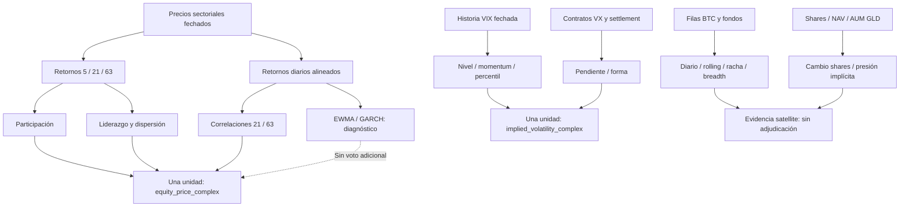

> **Actualización P8:** este documento conserva las reglas y gates de P1–P7. Los nueve grupos antes UNBOUND quedan vinculados por [el manifiesto P8](p8/parameter-manifest.json), con [contratos de precio, tiempo y evidencia](p8/README.md). Builder está habilitado para implementación fiel, pero no se ejecuta en esta sesión; producción sigue bloqueada.

# Especificación V2 — contrato simbólico congelado

`spec_version=regime-v2-prototype/1.0.0`. Aplicación de P1–P7; no código de producción.

## Separación entre reglas y parámetros

**FROZEN RULE**: arquitectura sin score, taxonomía, dependencias, fórmulas y unidades declaradas, precedencia de la tabla, semántica de missing, separación de dimensiones, inmutabilidad V1 y gates de publicación.

**PARAMETER REQUIRES VALIDATION**: los valores de `parameters.json`. No hay valor por defecto. Un manifiesto que conserve un parámetro bloqueante sin resolver **no puede instanciar un motor ni autorizar Builder**. El chequeo conceptual opera sobre estados, no convierte esas ausencias en datos de mercado.

Las ventanas 5/21/63, MA200 y EWMA λ=.94 se documentan porque existen en el checkout. Mantener sus definiciones en el inventario no constituye evidencia de superioridad predictiva. Cambiar una ventana requiere versión de feature, replay y comparación; no se optimiza contra retornos para embellecer la clasificación.

## Contrato temporal y de procedencia

Cada observación cruda debe conservar:

```text
observation_id              identificador estable y versionado
observation_date            fecha económica / sesión del dato
observation_end_at          cierre del intervalo, UTC, cuando se conozca
available_at               instante conservador desde el que este vintage es elegible
available_at_basis         PROVIDER_PUBLICATION | FIRST_OBSERVED | VINTAGE_UPPER_BOUND
first_observed_at           primera captura efectiva; no el último cache hit
retrieved_at                captura de estos bytes
as_of                      corte UTC solicitado por el consumidor
source_id / source_version proveedor + contrato, sin credenciales
source_observation_id       fila, instrumento, contrato y revisión si existen
raw_payload_hash           hash de bytes/filas canónicas conservadas
price_basis / currency      obligatorios para series de precios
status                     AVAILABLE | MISSING | STALE | INVALID | INSUFFICIENT_HISTORY
                           | UNVERIFIED_AVAILABILITY | DEMO | SOURCE_ERROR
freshness                  FRESH | STALE | UNKNOWN, con razón y política versionada
```

`available_at` no se fabrica con `observation_date + lag fijo`. Si se conoce la publicación del **vintage exacto**, se conserva su evidencia. Si no, `FIRST_OBSERVED` usa la captura real como límite conservador: la fila sirve desde ese instante, nunca retroactivamente. Un vintage solo fechado por día usa un límite superior documentado de ese día en su zona horaria; no se atribuye hora precisa ni se usa antes de ese límite. Si no puede fijarse un límite defendible, `UNVERIFIED_AVAILABILITY`.

`as_of` es un instante, no una cadena de fecha ambigua. El replay itera instantes de decisión previamente fijados. Filtra **antes** de cualquier transformada por fin de observación y por `available_at <= as_of`; selecciona únicamente revisiones ya elegibles. Una revisión nueva no modifica el input persistido de un snapshot anterior. Las funciones puras no consultan reloj, red, último snapshot ni caché global.

Un input derivado conserva `input_observation_ids`, `feature_version`, `transform_id`, parámetros, ventana efectiva, fecha inicial/final y `available_at = max(available_at de sus inputs)`. Su generación se registra aparte. Sus dependencias deben cubrir todas las observaciones usadas, incluidas las del denominador, semillas EWMA y población del percentil.

No parsear frases ES/EN de `lastUpdated` para recuperar metadatos. Capturarlos antes de construirlas. Igual longitud de arrays no prueba igualdad de fechas. Las series sectoriales y ratios se alinean por sesión; una sesión esperada ausente invalida la ventana afectada. No se interpola, rellena con cero ni convierte un intervalo de varios días en retorno diario.

La política de freshness compara la última observación elegible con la sesión/publicación esperada según calendario, zona y SLA de **esa fuente** (`FRESHNESS_POLICY`, pendiente). No usa el TTL como prueba de actualidad. Debe probar festivos, fines de semana y retrasos entre FRED, CFE, ETFs y fondos. El cache key incluye fuente, consulta, versión y vintage/corte pertinente; un hit conserva `first_observed_at` original.

`demo`, fallback sintético, datos malformados, NaN, ±Infinity, precios no positivos, fecha imposible, timestamp futuro o revisión sin trazabilidad nunca son inputs elegibles del core. Cero es un valor válido para un retorno o flujo **observado**, no para rellenar una celda vacía. Todos los estados de rechazo llevan reason codes; no se elimina la evidencia de fallo.

## Familias y dependencias

Una familia describe un mecanismo económico; un `dependency_group` establece la unidad máxima de concordancia. Separar subfamilias para explicar no crea votos.

| Subfamilia explicativa | Dependency group de concordancia | Uso |
|---|---|---|
| Participación, liderazgo, co-movement, riesgo realizado | `equity_price_complex` | Tres dimensiones distintas derivadas del mismo panel de precios. Una sola unidad de concordancia. |
| VIX spot y estructura de futuros VX | `implied_volatility_complex` | Dos vistas del mercado de volatilidad; se agrupan conservadoramente. No se presume independencia por cambiar de proveedor. |
| Flujos de ETFs BTC | `btc_etf_flows` | Satellite; cero votos core. |
| Participaciones/NAV GLD | `gld_share_pressure` | Satellite; cero votos core. |
| Pesos y escenarios PFL | `portfolio_specific` | Fuera del régimen. Compatibilidad pendiente. |

Las familias aquí son unidades **no duplicadas por construcción**, no una afirmación de independencia estadística entre precios y opciones. La concordancia inicial tiene, como máximo, dos unidades core. Dividirlas requiere evidencia material de no redundancia, versión nueva y gate de Groweer.



Los precios RSP/IWM/SPY y métricas de concentración basadas en precio se adscriben al mismo grupo de equity. Cambiar de Alpha Vantage a Yahoo no crea evidencia independiente del mismo instrumento. `fragilityScore`, `vixCompositeLabel`, `vixSeverity` legado y `readingSeverity` BTC son etiquetas derivadas, no inputs core adicionales. La lista exacta de padres está en `dependency-map.json`; las aristas expresan dependencias computacionales, no causalidad económica.

## Pilares

### A — Equity Internals

Universo inicial fijo, conforme a la tabla actual del adapter:

| Grupo | ETFs |
|---|---|
| growth | XLK, XLY, XLC |
| cyclical | XLF, XLE, XLI, XLB |
| defensive | XLV, XLP, XLU, XLRE |

No se retroextiende un ETF antes de su existencia ni se sustituye por otro en silencio. El uso de este universo y su sesgo de selección forma parte de la validación; la muestra homogénea no empieza antes de XLC. Los pesos de grupo son iguales **dentro** del grupo, siguiendo la definición actual; no son pesos sobre el régimen final.

**Participation** usa inicialmente `eq_positive_5` y `eq_positive_21`: número de los once ETFs cuyo retorno es estrictamente positivo. Un retorno igual a cero cuenta como observado no positivo, nunca como missing. Mínimo: once series elegibles con 22 cierres consecutivos y una misma sesión terminal. El denominador sigue siendo once; no se reduce cuando falla un ETF.

Sean `k_weak`, `k_broad` los parámetros pendientes, con `0 <= k_weak < k_broad <= 11` y `k_broad - k_weak >= 2` para dejar un interior MIXED.

| Prioridad | Condición | Participation |
|---|---|---|
| 0 | Falla elegibilidad, ventana, universo o fecha común | UNAVAILABLE |
| 1 | Ambos conteos >= `k_broad` | FAVORABLE |
| 2 | Ambos conteos <= `k_weak` | ADVERSE |
| 3 | Cualquier otra combinación observada | MIXED |

MA200, RSP/SPY e IWM/SPY permanecen en evidencia opcional durante la primera versión propuesta. Su ausencia se declara. No alteran subestado, incertidumbre ni régimen hasta superar validación incremental y activarse en una versión de reglas. Su registro está completo; su integración viva aún no existe en HEAD. Esto limita explícitamente «amplio» a participación sectorial proxy, sin afirmar amplitud de todas las acciones ni ausencia de concentración por capitalización.

**Leadership** usa medias aritméticas de retornos de 21 sesiones por los tres grupos. Mínimo: mismos once ETFs y 22 cierres elegibles. Sea `g` la media growth, `c` cyclical, `d` defensive y `gap > 0` el parámetro pendiente, en puntos porcentuales:

```text
FAVORABLE si max(g,c) - d >= gap
ADVERSE  si d - max(g,c) >= gap
MIXED    en otro caso observado
UNAVAILABLE si falta evidencia mínima
```

Si growth y cyclical empatan, guardar ambos como líderes; nunca romper el empate por orden del array. La regla compara el bloque no defensivo con defensivos. **No copia** el `reading` V1 que compara primero y segundo de tres grupos, lo cual podría llamar «mixto» a un empate growth/cyclical con defensivos claramente rezagados. La separación semántica queda declarada, sin alterar V1. Dispersión, concentración y persistencia se explican aparte; no se transforman en puntos.

**Estado A agregado** (conservar siempre Participation y Leadership):

| Participation / Leadership | FAVORABLE | MIXED | ADVERSE |
|---|---|---|---|
| FAVORABLE | FAVORABLE | MIXED | MIXED |
| MIXED | MIXED | MIXED | ADVERSE |
| ADVERSE | MIXED | ADVERSE | ADVERSE |

Cualquier subestado `UNAVAILABLE` hace A `UNAVAILABLE`. Una oposición interna produce `MIXED`, con los dos hechos explícitos. Esta agregación no destruye los subestados necesarios para diferenciar amplio/selectivo.

### B — Volatility & Stress Structure

Inputs decisorios: nivel VIX, momentum relativo de 1 y 5 sesiones y pendiente VX1–VX2. Mínimo normal: seis cierres VIX elegibles, VX1 y VX2 mensuales no vencidos, positivos, de un mismo settlement, y fechas compatibles según política de freshness. No interpolar contratos ni usar VX3 como VX2 si falta el segundo. VX3–VX9, percentil y realized risk quedan como confirmaciones descriptivas.

Sean `v` el nivel, `j1/j5` cambios relativos en porcentaje, `s=100*(VX2/VX1-1)` y los parámetros pendientes:

```text
0 < v_watch < v_adverse < v_stress
jump_1 > 0; jump_5 > 0
0 <= curve_flat < curve_adverse
fast = j1 >= jump_1 OR j5 >= jump_5
inverted = s <= -curve_adverse
```

Prioridad:

1. Falta evidencia mínima → `UNAVAILABLE`.
2. `v >= v_stress` **o** (`v >= v_adverse` y `fast` y `inverted`) → `STRESS`.
3. `v >= v_adverse` **o** `inverted` → `ADVERSE`.
4. `v >= v_watch` **o** `fast` **o** `s <= curve_flat` → `WATCH`.
5. Resto con evidencia elegible → `BENIGN`.

`s <= curve_flat` incluye inversión leve y curva plana: una pequeña backwardation no cae accidentalmente en BENIGN. Un VIX bajo y curva invertida conserva ambos hechos. El percentil no añade un voto ni un override inicial; no hay sustitución desde el composite legado.

Con VIX elegible `v >= v_stress` y otra familia crítica ausente, puede emitirse `stress_observed=true` como **alerta de evidencia**, aunque B o el régimen no puedan completarse. `regime_v2` permanece `null` si falla el mínimo global. Se mantiene así la advertencia observable sin convertir datos ausentes en un régimen. No hay hysteresis en el prototipo; un STRESS con core completo entra en esa misma evaluación.

### C — Fragility / Co-movement

Inputs decisorios: correlación media de Pearson de 21 y 63 **retornos diarios** sobre el mismo universo y fechas. Promedio simple de los 55 pares únicos. Mínimo: 64 cierres comunes consecutivos de cada uno de los once ETFs, 63 retornos y varianza no nula de cada serie en ambas ventanas. Una ventana corta, un par degenerado o una fecha faltante hace el pilar `UNAVAILABLE`; no se promedian solo los pares supervivientes.

`delta_corr = rho21 - rho63` mide diferencia entre ventanas anidadas, **no cambio temporal** de la correlación. `corr_change_21` del registry es otra feature opcional: `rho21(t) - rho21(t-21)` con inputs propios. No se etiquetan ambas igual.

Con parámetros pendientes `0 <= rho_floor < rho_high < 1` y `delta_rising > 0`:

1. Evidencia mínima ausente → `UNAVAILABLE`.
2. `rho21 >= rho_high` → `HIGH`.
3. `rho21 >= rho_floor` y `delta_corr >= delta_rising` → `RISING`.
4. Resto observado → `LOW`.

El dominio aprobado debe demostrar que RISING es realizable con ventanas **anidadas** y matriz de correlación semidefinida positiva, no solo con dos números inventados. La correlación positiva alta mide co-movement y menor diversificación, no dirección negativa por sí sola. El régimen no pasa a DEFENSIVO solo porque C sea HIGH.

`defensiveGrowthCorrelation21d`, EWMA y sus cambios son contexto dentro del mismo grupo. GARCH es diagnóstico redundante hasta ablation; `fragilityScore`, etiquetas de riesgo con nulls y componentes PFL incompatibles se excluyen. LOW no significa probabilidad baja de pérdida.

## Tabla de adjudicación

Tabla de **primera coincidencia**, en `decision-table.json`. A se deriva de los dos subestados, nunca se acepta como input contradictorio con ellos. Las filas se evalúan después de elegibilidad y clasificación de pilares.

| ID / orden | Participation | Leadership | A | B | C | Resultado |
|---|---|---|---|---|---|---|
| R00 | Algún subestado/pilar crítico UNAVAILABLE | — | — | — | — | `reading_status=INCOMPLETE`, `regime_v2=null` |
| R01 | cualquiera elegible | cualquiera elegible | cualquiera | STRESS | cualquiera elegible | STRESS |
| R02 | cualquiera | cualquiera | ADVERSE | WATCH o ADVERSE | cualquiera | DEFENSIVO |
| R03 | cualquiera | cualquiera | cualquiera | ADVERSE | HIGH | DEFENSIVO |
| R04 | FAVORABLE | FAVORABLE | FAVORABLE | BENIGN | LOW | RISK-ON AMPLIO |
| R05 | MIXED | FAVORABLE | MIXED | BENIGN | LOW | RISK-ON SELECTIVO |
| R06 | Resto completo | — | — | — | — | TRANSICIÓN |

Los guiones son columnas no consultadas, nunca valores missing. R01 prevalece sobre R02/R03. R00 prevalece siempre para la clasificación global; la alerta de stress se conserva separada. No hay «Cautela», «Risk-on constructivo», score, sesgo numérico ni regla satellite escondida.

Cada salida guarda `rule_id`, condiciones activadas, `why_codes`, grupos sustentadores, grupos contradictorios y evidencia interna conflictiva. TRANSICIÓN significa combinación completa que no satisface otra configuración; su `why` detalla si es divergencia, mezcla o deterioro. No presupone que el mercado vaya a cambiar mañana.

Ejemplos incómodos: participación ADVERSE + liderazgo MIXED + B BENIGN + C RISING → TRANSICIÓN; A FAVORABLE + B ADVERSE + C LOW → TRANSICIÓN; A FAVORABLE + B BENIGN + C HIGH → TRANSICIÓN. No se adjudica una narración uniformemente favorable o defensiva.

## Concordancia, incertidumbre y calidad

### Concordancia

Primero reducir cada `dependency_group` core a un descriptor cualitativo. No contar filas de evidencia, métricas, ventanas, ETFs, vendors, pilares ni condiciones de una regla.

Descriptor equity, ordenado:

1. A o C UNAVAILABLE → descriptor ausente.
2. A FAVORABLE y C HIGH → MIXED (contradicción interna).
3. A ADVERSE o C HIGH → ADVERSE.
4. A FAVORABLE y C LOW → FAVORABLE.
5. Resto completo → MIXED.

Descriptor volatilidad: BENIGN → FAVORABLE; WATCH → MIXED; ADVERSE/STRESS → ADVERSE; UNAVAILABLE → ausente.

| Dos descriptores core observados | `concordance_v2` |
|---|---|
| Ambos FAVORABLE o ambos ADVERSE | HIGH |
| Uno FAVORABLE, otro ADVERSE | LOW |
| Al menos uno MIXED | MEDIUM |
| Falta un grupo | `null`, reason `INSUFFICIENT_COMPARABLE_FAMILIES` |

Dos MIXED no se convierten en HIGH. El null es ausencia de evaluación, no un cuarto nivel de concordancia. Las satellites tienen su propia disponibilidad y no afectan esta dimensión. HIGH no afirma independencia estadística, probabilidad, exactitud o expectativa de rentabilidad.

Los grupos sustentadores/contradictorios son **respecto al resultado**: para risk-on, FAVORABLE sustenta y ADVERSE contradice; para defensivo/stress, a la inversa. MIXED expone evidencia de ambos lados sin duplicar el grupo. Para TRANSICIÓN se guardan los descriptores y las combinaciones que impiden las otras filas, sin llamar «adverso» a todo soporte de transición. Las condiciones de R02/R03 citan A y C, pero estas nunca se listan como dos familias independientes.

### Incertidumbre

Ambigüedad de adjudicación bajo alternativas cualitativas explícitas. No depende de una penalización de cobertura ni usa porcentaje.

Para core completo, construir conjuntos de sensibilidad:

- Participation MIXED → {FAVORABLE, MIXED, ADVERSE}; en otro caso su singleton.
- Leadership MIXED → {FAVORABLE, MIXED, ADVERSE}; en otro caso su singleton.
- B WATCH → {BENIGN, WATCH, ADVERSE}; en otro caso su singleton.
- C RISING → {LOW, RISING, HIGH}; en otro caso su singleton.

Evaluar la misma tabla en el producto cartesiano, recalculando A, y conservar los regímenes distintos como `plausible_regimes_v2` en orden canónico. Son contrafactuales de sensibilidad, no observaciones ni probabilidades. Cualquier restricción conjunta adicional debe estar documentada; esta primera aproximación es conservadora.

`LOW` si hay un único régimen plausible; `MEDIUM` si hay exactamente dos; `HIGH` si hay tres o más. El tamaño del conjunto sirve únicamente para esta categoría, no adjudica ni ordena el régimen. El resultado observado siempre pertenece al conjunto. No se suavizan ni ponderan esos estados. Con core incompleto, `uncertainty_v2=null` y `reason=NOT_CLASSIFIABLE`; no se transforma missing en HIGH. Se pueden listar condiciones faltantes, sin fabricar un set probabilístico.

Un STRESS completo puede tener LOW por una regla inequívoca aunque la concordancia sea LOW; una transición puede tener LOW si sus condiciones completas solo producen esa lectura. Es ambigüedad **dentro de este ruleset**, no certeza sobre el mercado ni calibración alrededor de umbrales. La sensibilidad numérica a umbrales es una comprobación de validación separada y obligatoria.

### Calidad de datos

Registrar por feature y familia cobertura, último dato elegible, freshness, fuente, errores, ventanas y razón de ausencia. `automated` no equivale a fresh y no basta para COMPLETE.

- `INSUFFICIENT`: cualquier mínimo crítico de A/B/C falla; `reading_status=INCOMPLETE`. No cambia un dato faltante por MIXED/LOW/BENIGN.
- `PARTIAL`: mínimos core completos, pero alguna feature opcional **activada en el perfil** o satellite inicial no es elegible.
- `COMPLETE`: mínimos core y todas las features opcionales del perfil están elegibles y frescas.

El perfil enumera explícitamente qué opcionales se intentan; añadir una feature PARK al registro no degrada la calidad de todos los snapshots. El perfil inicial para evaluación incluye diagnóstico VIX percentil y evidencia satellite BTC diario/rolling5 y GLD shares5; MA200/ratios están inventariados pero no se activan hasta resolver fuentes. Los resultados por satellite se conservan aunque fallen otros componentes. La ausencia de una satellite puede bajar COMPLETE a PARTIAL, **nunca** cambiar régimen, concordancia o incertidumbre.

## Satellites

BTC y GLD enriquecen evidencia y «qué vigilar». No tienen acceso a la tabla, descriptor core, set de incertidumbre ni política de hysteresis. Cambiar cualquier dato satellite con core constante debe conservar esos resultados exactamente, incluidos `why_codes` core. Solo pueden cambiar evidencia satellite y calidad de sus fuentes.

BTC: preservar signos observados, ventanas completas, nulos por fondo, cobertura de cada fila, racha truncada por inicio de historial o celda ausente y fuente concreta. Antes de su historia homogénea iniciada en 2024, `NOT_IN_EXISTENCE`, no flujos cero. No asignar automáticamente dirección al mercado general a partir del signo de flujo BTC.

GLD: unidades en participaciones, fracción o USD según feature. `Δshares*latest_NAV` es un proxy, no suma de flujos diarios oficiales. NAV y AUM son controles de coherencia y no votos. Valores neutros observados y ventanas enfrentadas se distinguen en evidencia aunque V1 use la misma etiqueta.

## Envelope versionado para Builder

Contrato conceptual, aditivo; el builder concretará los tipos sin sustituir registros antiguos:

```text
snapshot_schema_version
snapshot_id / input_hash / as_of
engine_version=v2
feature_registry_version / rules_version / parameters_version
source_versions / freshness_policy_version / universe_version
mode=SHADOW | RETROSPECTIVE_RECONSTRUCTION | REPLAY_POINT_IN_TIME

v1_snapshot_ref              referencia y hash del original, si existe
regime_v1 / score_v1 / confidence_v1
v1_origin                   FROZEN_ORIGINAL | CONTEMPORARY_RUN | UNAVAILABLE

reading_status              COMPLETE | INCOMPLETE
regime_v2                   cinco regímenes o null, jamás LECTURA INCOMPLETA
pillar_states_v2            A con Participation/Leadership; B; C
evidence_v2                 features, valores, unidades, fuentes, estados y dependencias
concordance_v2              HIGH | MEDIUM | LOW | null
uncertainty_v2              LOW | MEDIUM | HIGH | null
plausible_regimes_v2        sensibilidad del ruleset, no distribución
data_quality_v2             COMPLETE | PARTIAL | INSUFFICIENT
rule_id / why_codes / supporting_groups / contradicting_groups
stress_observed / failure_reasons
```

La etiqueta de presentación de `reading_status=INCOMPLETE` será LECTURA INCOMPLETA (EN: INCOMPLETE READING), separada del enum de régimen. Códigos de régimen sugeridos: `RISK_ON_BROAD`, `RISK_ON_SELECTIVE`, `TRANSITION`, `DEFENSIVE`, `STRESS`. Traducciones: risk-on amplio/broad, selectivo/selective, transición/transition, defensivo/defensive, stress/stress. No se modifica la traducción V1.

Un snapshot V1 ausente queda ausente. Recalcular V1 con una captura nueva puede servir como challenger, identificado como reconstrucción y con su versión de código, nunca como sustitución de un informe. No se introduce `score_v2`, fórmula ponderada final ni `confidence_v2`.

## Alcanzabilidad conceptual

| Régimen | Participation | Leadership | B | C | Regla |
|---|---|---|---|---|---|
| Risk-on amplio | FAVORABLE | FAVORABLE | BENIGN | LOW | R04 |
| Risk-on selectivo | MIXED | FAVORABLE | BENIGN | LOW | R05 |
| Transición | ADVERSE | MIXED | BENIGN | RISING | R06 |
| Defensivo | ADVERSE | ADVERSE | ADVERSE | HIGH | R02 |
| Stress | FAVORABLE | FAVORABLE | STRESS | LOW | R01 |

No hay rangos de score que hagan inaccesible una etiqueta. La prueba recorre las 320 configuraciones del vocabulario P×L×B×C, incluidas ausencias; verifica unicidad por precedencia, cobertura, testigos, contradicciones, independencia de satellites y dimensiones cualitativas. Las 108 configuraciones completas no son 108 escenarios históricos independientes.

Para el gate desde inputs crudos se exige construir **un solo panel de precios por escenario**. No vale asignar participación, liderazgo y correlaciones arbitrariamente a fixtures separadas. Es posible conceptualmente cambiar medias de retornos manteniendo co-movement bajo mediante innovaciones sectoriales independientes; aumentar su componente común produce co-movement alto. Un shock de opciones puede coexistir con internals aún favorables. Pero hay que demostrar realizabilidad de las bandas y ventanas anidadas con los parámetros elegidos. El prototipo no afirma esa validación pendiente.

## Persistencia, crecimiento y publicación

Duraciones futuras se calculan con snapshots consecutivos de la misma versión: guardar primer/último instante observado, número de sesiones clasificables y huecos. No extender una duración sobre missing ni unir versiones sin contrato explícito. Velocidad de deterioro/recuperación se documentará como cambios fechados de pilares, sin restar números ordinales arbitrarios. Hysteresis está `PARK` hasta replay; no se eligen 2/3/5 días en esta etapa.

Los activos HYG/LQD, IEF/TLT/SHY, UUP, USO/GLD/SLV existen en el snapshot estadístico local, pero no acreditan crédito, yields, DXY ni flujos oficiales respectivamente. Groweer deberá evaluar significado, historia, disponibilidad temporal, redundancia, información incremental y mantenimiento. No se ha ejecutado ese rol ni se declara superado su gate.

V1 sigue público. Builder será paralelo; Designer trabajará después de los gates. El release requiere replay estricto, comparación V1 y benchmarks, ablation, revisión de divergencias en shadow, rollback y aceptación explícita antes de cutover. Ninguna prueba sintética del prototipo reemplaza esas obligaciones.
