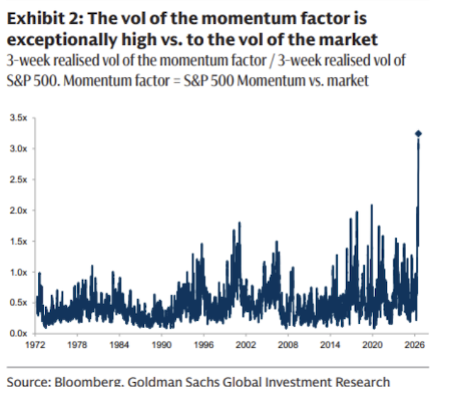
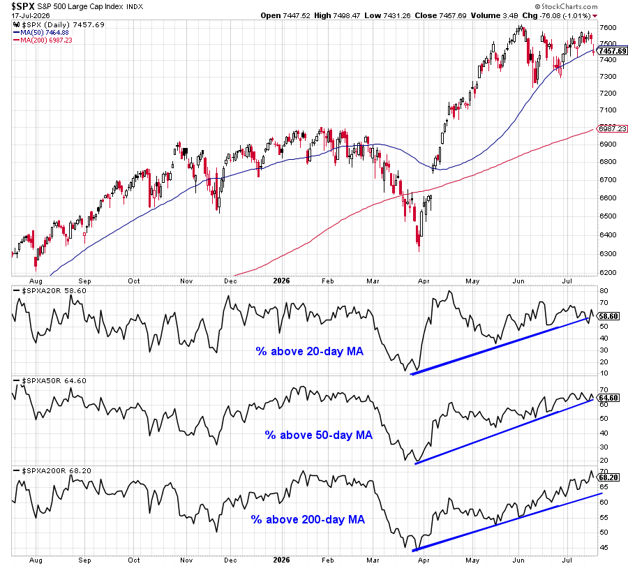
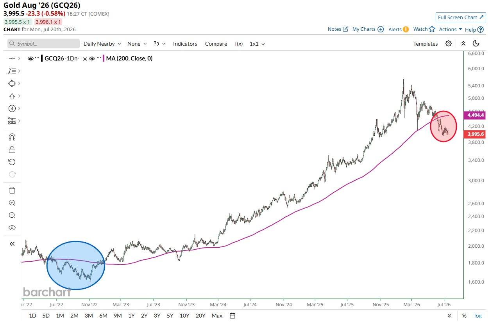
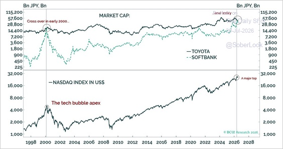
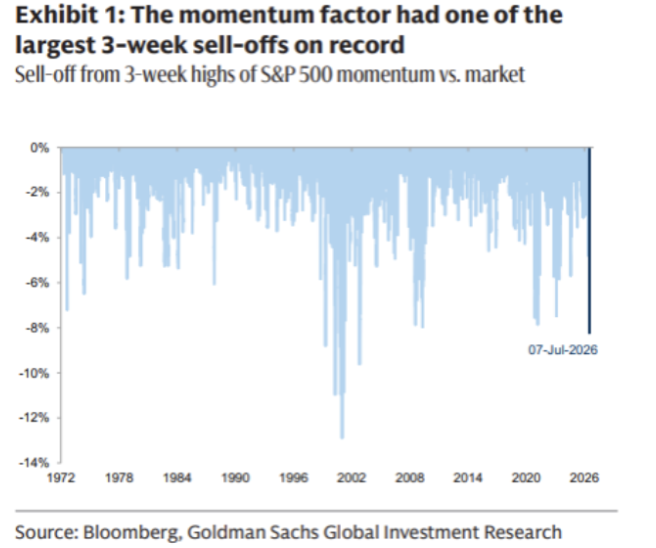
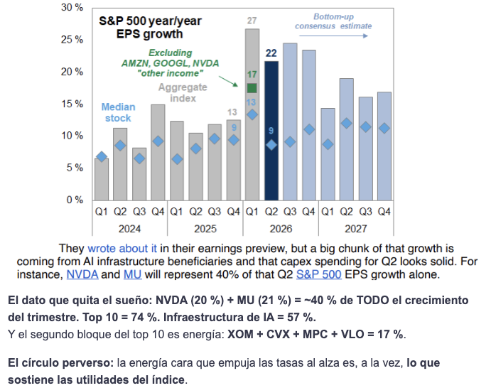
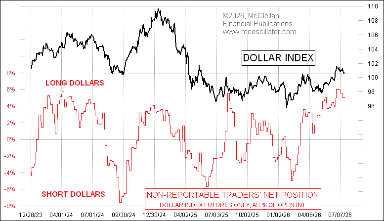
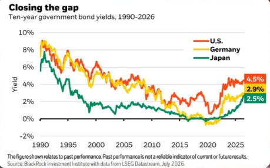

# El índice aguanta, pero por dentro el mercado ya cambió

Resultados, rotación, dólar y la prueba real de la inteligencia artificial.

- Edición: Segundo informe de julio
- Autor: Luigui Herrera
- Publicación: 2026-07-20
- Actualización: 2026-07-20
- Corte editorial: 2026-07-17
- Corte de datos automáticos: 2026-07-18
- URL editorial primaria: https://www.luiguiherrera.com/informes/segundo-informe-julio-2026

> La página editorial indicada arriba es la representación primaria de este informe.

## Tesis principal

El S&P 500 conserva su estructura de medio y largo plazo, pero debajo del índice ocurrió una rotación violenta. Las acciones individuales se están moviendo mucho más que el mercado agregado: unas suben mientras otras caen, y el índice oculta parte de ese cambio interno.

## Resumen ejecutivo

- **VOO:** El índice aguanta, pero ya no explica bien la dispersión interna.
- **GLD:** El oro sigue débil en precio y conserva su función estructural.
- **EWJ:** Japón mantiene fortaleza relativa, con más peso de tecnología, yen y tasas.
- **FXI:** China sigue táctica: valoraciones bajas no bastan sin catalizador.
- **BTC / ETH:** Cripto volvió a comportarse como beta alta, no como cobertura defensiva.
- **Stockpicking:** La dispersión abre oportunidades, pero también castiga duplicar factores.

### Factor transversal: DXY / USD/COP

El dólar conserva apoyo, aunque el posicionamiento largo luce congestionado y USD/COP mantiene factores locales propios.

## Contexto por activo

### VOO / S&P 500

**El índice resistió, pero la volatilidad interna aumentó.**

El índice resistió mejor que sus antiguos líderes. La corrección se concentró en momentum, acciones que venían subiendo por inercia y liderazgo reciente, semiconductores e infraestructura de IA, sin una venta indiscriminada. Cerca del 68 % de los componentes sigue sobre su media de 200 días, una señal de amplitud estructural todavía razonable, aunque la amplitud de corto plazo se deterioró especialmente en tecnología. La volatilidad de acciones individuales está cerca de niveles extremos y la correlación del índice se acerca a mínimos históricos: unas acciones suben mientras otras caen. La temporada de resultados será el siguiente catalizador.

### GLD

**El oro mantiene una debilidad técnica real.**

El oro acumula más de 30 sesiones por debajo de su media de 200 días, la racha más prolongada desde 2022. No funcionó como refugio durante la corrección del momentum porque dólar firme, rendimientos elevados y posicionamiento sistemático débil presionaron el precio. La debilidad es técnica y real, no una fluctuación aislada. Aun así, su función estructural de diversificación no depende de liderar cada semana. SLV sirve solo como comparación: la plata mezcla sensibilidad monetaria con ciclo industrial. JNUG debe leerse aparte: es un instrumento táctico y apalancado, no una posición estructural en oro.

### EWJ

**Japón conserva fortaleza relativa con liderazgo más concentrado.**

Japón mantiene fortaleza relativa entre mercados desarrollados, con liderazgo más concentrado en tecnología, inversión y activos ligados a IA. SoftBank superó a Toyota por capitalización por segunda vez en la serie mostrada; la primera coincidió con la burbuja tecnológica de 2000. La comparación sirve como advertencia de concentración narrativa, no como predicción automática de colapso. A la vez, los rendimientos japoneses se acercan a los de Alemania y Estados Unidos, por lo que normalización monetaria y yen vuelven a importar. EWJ mantiene exposición al yen; HEWJ sirve como referencia para entender cuánto puede cambiar la lectura al cubrir ese riesgo cambiario.

### FXI

**China sigue táctica y todavía carece de liderazgo propio.**

Los gestores institucionales redujeron exposición a mercados emergentes y China todavía no recupera liderazgo sostenido. Las valoraciones bajas no han sido suficientes para atraer un flujo consistente. FXI conserva carácter táctico y contrarian: puede diversificar la concentración estadounidense, pero necesita catalizadores propios para dejar de ser solo una historia barata.

### BTC / ETH

**Cripto volvió a comportarse como beta alta.**

BTC y ETH se comportaron como activos de beta alta: activos que suelen amplificar el apetito por riesgo, tanto al alza como a la baja. No funcionaron como liquidez ni como cobertura defensiva durante la corrección de tecnología y momentum. La fortaleza del dólar redujo apetito por riesgo y recordó que cripto sigue dependiendo de liquidez, flujos, tasas y DXY. BTC suele conservar mayor fortaleza relativa; ETH puede mostrar más sensibilidad a desapalancamiento y cambios de narrativa.

### Stockpicking

**La dispersión aumenta oportunidades y también errores de concentración.**

La dispersión elevada, diferencias grandes entre ganadores y perdedores, favorece selección activa, pero también aumenta la posibilidad de pérdidas grandes por acción. La baja correlación permite que compañías distintas tengan resultados muy diferentes. La corrección del momentum mostró que varias posiciones aparentemente distintas podían depender del mismo factor: semiconductores estadounidenses, Taiwán, Corea, IA y high beta pueden ser una sola apuesta disfrazada de diversificación. La temporada de resultados mueve el foco desde expectativas hacia ventas, márgenes, guidance, la guía que entrega la empresa, retorno del CapEx, inversión de capital, financiación y capacidad de convertir IA en beneficios.

### DXY y USD/COP

**El dólar conserva apoyo, pero su posicionamiento está congestionado.**

CTAs, estrategias sistemáticas que suelen seguir tendencias, y operadores no reportables mantienen posiciones largas elevadas en dólares. El posicionamiento largo en USD está congestionado, aunque el DXY, índice que resume el dólar frente a una cesta de divisas desarrolladas, conserva apoyo por rendimientos, tasas y demanda defensiva. Después de CPI y PPI aumentó el peso de escenarios de tasas algo más bajas, y la convergencia entre rendimientos de Estados Unidos, Alemania y Japón puede reducir parte de la ventaja relativa del dólar. USD/COP no se mueve uno a uno con DXY: también pesan petróleo, riesgo global, flujos a emergentes, tasas en Colombia, situación fiscal y riesgo político local.

## Lectura de seguimiento por activo

### VOO / S&P 500

**El índice no está roto, pero su calma no refleja bien lo que ocurre debajo.**

Clasificación: **núcleo**

- **Qué pasó:** El S&P 500 resistió mejor que momentum, semiconductores e infraestructura de IA. La venta no fue indiscriminada: la amplitud estructural sigue razonable, mientras la amplitud corta se deterioró en tecnología.
- **Qué cambió:** La correlación baja significa que el índice agrega movimientos opuestos. Puede verse tranquilo aunque haya rotación violenta debajo.
- **Qué esperamos:** Escenario base: mercado constructivo, pero más volátil y selectivo. El índice puede continuar firme si los resultados sostienen expectativas y la correlación permanece baja.
- **Qué vigilar:** Riesgo principal: decepción en IA, inflación o tasas que eleve correlación y lleve al índice la volatilidad hoy concentrada en acciones. Vigilar amplitud de 20, 50 y 200 días, VIX, correlación implícita, grandes tecnológicas, reacción T+3 a T+5 y ventas sistemáticas.
- **Lectura del informe:** VOO conserva función de núcleo. La estabilidad del índice no debe confundirse con ausencia de riesgo interno.
- **Antes / contexto:** El liderazgo descansaba en tecnología, IA, momentum y flujos.
- **Ahora / cambio:** El índice aguanta, pero los antiguos líderes corrigen y la dispersión sube.
- **Próximas señales:** Resultados y amplitud dirán si la rotación es sana o empieza a contaminar al índice.

### GLD

**El oro atraviesa una debilidad técnica real.**

Clasificación: **diversificador**

- **Qué pasó:** GLD acumula una racha prolongada bajo la media de 200 días. Dólar firme, rendimientos elevados y posicionamiento sistemático débil explican la presión.
- **Qué cambió:** El oro no actuó como refugio durante la corrección del momentum, lo que obliga a separar su lectura estructural de su comportamiento semanal.
- **Qué esperamos:** Escenario base: GLD puede seguir débil mientras DXY y rendimientos reales, tasas ajustadas por inflación, permanezcan elevados. Señal positiva: recuperación de la media de 200 días, caída del dólar o moderación de esos rendimientos.
- **Qué vigilar:** Riesgo principal: mayor deterioro técnico y continuación de salidas sistemáticas. Vigilar media de 200 días, tasas reales, dólar y flujos de presión en GLD.
- **Lectura del informe:** La diversificación de GLD y la operación táctica en JNUG son lecturas distintas. JNUG no debe equipararse con una posición estructural en oro.
- **Antes / contexto:** GLD funcionaba como diversificador de régimen.
- **Ahora / cambio:** La presión técnica domina y los productos apalancados amplifican movimientos de corto plazo.
- **Próximas señales:** La recuperación de la media larga sería la primera mejora seria.

### EWJ

**Japón sigue fuerte, pero el liderazgo también se está concentrando.**

Clasificación: **internacional**

- **Qué pasó:** Japón conserva fortaleza relativa entre desarrollados. El liderazgo se inclinó hacia tecnología, inversión y activos ligados a IA, con la comparación SoftBank/Toyota como advertencia de concentración narrativa.
- **Qué cambió:** La normalización monetaria y el yen vuelven al centro porque los rendimientos japoneses se acercan a los de Alemania y Estados Unidos.
- **Qué esperamos:** Escenario base: sesgo favorable mientras Japón conserve fortaleza relativa. Señal positiva: liderazgo más amplio y yen ordenado.
- **Qué vigilar:** Riesgo principal: concentración tecnológica, normalización monetaria, movimientos bruscos del yen y toma de beneficios. EWJ mantiene riesgo yen; la cobertura cambiaria reduce gran parte de esa exposición.
- **Lectura del informe:** Distinguir retorno del mercado japonés de retorno cambiario. La exposición sin cobertura y la exposición cubierta no ofrecen el mismo resultado.
- **Antes / contexto:** Japón venía liderando dentro de Asia desarrollada.
- **Ahora / cambio:** El liderazgo se concentra y el yen vuelve a pesar.
- **Próximas señales:** Fortaleza relativa y política monetaria definirán la lectura.

### FXI

**China sigue táctica: valoraciones bajas no bastan sin catalizador.**

Clasificación: **contrarian**

- **Qué pasó:** La reducción de exposición a emergentes y la falta de liderazgo sostenido mantienen a FXI en una lectura de rezago.
- **Qué cambió:** El mercado sigue exigiendo algo más que múltiplos bajos: necesita flujo, confianza y mejora de beneficios.
- **Qué esperamos:** Escenario base: comportamiento táctico y dependiente de catalizadores. Señal positiva: estímulo creíble, recuperación de confianza, mejora de flujos y fortaleza relativa.
- **Qué vigilar:** Riesgo principal: permanecer barata sin compradores ni crecimiento de beneficios. Vigilar datos chinos, dólar, flujos a emergentes y respuesta política.
- **Lectura del informe:** FXI puede diversificar concentración estadounidense, pero todavía no confirma liderazgo propio.
- **Antes / contexto:** El rezago ofrecía una hipótesis contrarian.
- **Ahora / cambio:** La falta de flujo consistente mantiene la cautela.
- **Próximas señales:** Solo catalizadores claros cambiarían la lectura.

### BTC / ETH

**Cripto sigue siendo beta alta, sensible a liquidez, dólar y tecnología.**

Clasificación: **alta beta**

- **Qué pasó:** BTC y ETH no actuaron como liquidez ni como cobertura defensiva. La corrección de tecnología, momentum y la fortaleza del dólar redujeron apetito por riesgo.
- **Qué cambió:** La lectura vuelve a separar precio spot de flujos y narrativa. BTC suele conservar mejor fortaleza relativa; ETH puede ser más sensible a desapalancamiento.
- **Qué esperamos:** Escenario base: alta sensibilidad a liquidez, dólar y apetito por riesgo. Señal positiva: DXY más débil, tasas más bajas, estabilización de momentum y regreso de flujos.
- **Qué vigilar:** Riesgo principal: desapalancamiento, dólar fuerte y ampliación de la corrección tecnológica. Vigilar BTC spot, ETH spot, VIX, DXY y condiciones financieras.
- **Lectura del informe:** No tratarlos como activos defensivos. Funcionan mejor como lectura de beta y liquidez.
- **Antes / contexto:** La liquidez sostenía el apetito por cripto.
- **Ahora / cambio:** La beta frente a tecnología vuelve a quedar visible.
- **Próximas señales:** Dólar, tasas y momentum marcarán la estabilidad del rebote.

### Stockpicking

**La selección gana importancia, pero el tamaño de posición gana todavía más.**

Clasificación: **clave**

- **Qué pasó:** La dispersión elevada favorece selección activa: compañías diferentes pueden tener resultados muy distintos. También aumenta el riesgo de pérdidas grandes por acción. Tener cinco acciones distintas no sirve de mucho si las cinco dependen de la misma historia.
- **Qué cambió:** La corrección del momentum mostró que semiconductores estadounidenses, Taiwán, Corea, IA y high beta pueden representar una sola apuesta. Resultados cambiarán el foco hacia ventas, márgenes, guidance, retorno del CapEx, financiación y capacidad de convertir IA en beneficios.
- **Qué esperamos:** Escenario base: más oportunidades individuales y menos utilidad en comprar sectores completos sin filtro. Prioridades: beneficios reales, márgenes defendibles, catalizadores propios, balance, financiación, guidance y tamaño de posición.
- **Qué vigilar:** Riesgos: duplicar factores, comprar antes de resultados sin margen, interpretar toda caída como oportunidad, depender de una sola narrativa y perseguir rebotes de momentum antes de confirmación. En IA y semiconductores, mirar capex y márgenes; en financieras, crédito y provisiones; en salud, guidance y regulación; en industriales e infraestructura, backlog y costes; en consumo, demanda y poder de precio.
- **Lectura del informe:** El crecimiento agregado esperado de EPS ronda 22 %, pero la acción mediana estaría cerca de 9 %. Infraestructura de IA explicaría cerca del 60 % del crecimiento; MU y NVDA más del 40 %, y los diez mayores contribuyentes cerca del 75 %. La reacción útil suele verse entre T+3 y T+5, no necesariamente el primer día.
- **Antes / contexto:** El índice permitía ignorar parte de la dispersión.
- **Ahora / cambio:** La dispersión expone dependencias comunes y errores de diversificación.
- **Próximas señales:** Resultados separarán narrativas sólidas de momentum vulnerable.

### DXY y USD/COP

**El dólar sigue diversificando frente al peso, pero el posicionamiento está cargado.**

Clasificación: **divisa**

- **Qué pasó:** El DXY conserva apoyo por rendimientos, tasas y demanda defensiva. Al mismo tiempo, CTAs y operadores no reportables mantienen largos elevados en dólares, una señal de posicionamiento congestionado.
- **Qué cambió:** Tras CPI y PPI aumentó el peso de escenarios de tasas algo más bajas. La convergencia de rendimientos entre Estados Unidos, Alemania y Japón puede reducir parte de la ventaja relativa del dólar.
- **Qué esperamos:** Escenario base: dólar todavía firme, aunque con riesgo creciente de reversión por posicionamiento. Puede fortalecerse si la Fed sigue restrictiva, suben rendimientos o cae apetito por riesgo; puede debilitarse si modera inflación, la Fed resulta menos dura, caen rendimientos o se cierran largos.
- **Qué vigilar:** Para USD/COP mirar además petróleo, riesgo colombiano, flujos hacia emergentes, política fiscal y monetaria local. DXY y USD/COP no se mueven siempre uno a uno.
- **Lectura del informe:** La exposición en dólares sigue diversificando frente al peso colombiano, pero un posicionamiento tan cargado aumenta el riesgo de una corrección rápida del dólar.
- **Antes / contexto:** El dólar ofrecía defensa y rendimiento relativo.
- **Ahora / cambio:** El apoyo sigue, pero el consenso largo luce más lleno.
- **Próximas señales:** Inflación, Fed, petróleo y riesgo local marcarán USD/COP.

## Lecturas automáticas al cierre del informe

Snapshot histórico congelado. Datos con corte a **2026-07-18**. Las cifras reproducen el estado publicado y no representan datos vigentes.

### Régimen al corte

| Campo | Valor |
|---|---|
| Régimen | Cautela |
| Score | 36/100 |
| Confianza | 58% |
| Sesgo | cautious |
| Interpretación histórica | El mercado muestra deterioro en varias lecturas, pero aún no hay confirmación suficiente para clasificarlo como estrés. Ponderación actual: rotación sectorial 45%, VIX 40%, BTC ETF flows 15% y FedWatch 0% mientras esté pendiente. |

#### Qué impulsó

- Rotación: Rotación mixta; no domina una lectura defensiva extrema.
- BTC ETF flows: Flujos mixtos aportan lectura neutral.

#### Qué frenó

- Rotación: Defensivos lideran mientras growth/cíclicos quedan débiles.
- Volatilidad: Vigilancia: zona de vigilancia.
- Momentum VIX: VIX subiendo rápido; aumenta la cautela.

#### Qué vigilar

- Curva VIX: Contango moderado.
- Flujos BTC ETF: Flujos mixtos.
- La lectura sugiere una rotación mixta. No implica dirección futura del mercado.

### Índices principales vía ETF

| Ticker | Retorno 1W | Media larga | Distancia a máximos |
|---|---:|---:|---:|
| SPY | -0.8% | +7.2% | -1.9% |
| QQQ | -2.3% | +8.7% | -6.7% |
| DIA | -0.7% | +7.4% | -1.7% |
| IWM | +0.2% | +12.0% | -2.1% |

### Rotación sectorial

- Sectores positivos: **5 / 11**
- Sectores negativos: **6**
- Dispersión 1W: **+2.6%**
- Lectura al publicar: La lectura sugiere una rotación mixta. No implica dirección futura del mercado.

| Grupo | Ticker | Nombre | Retorno 1W |
|---|---|---|---:|
| Líder | XLU | Utilities | +1.2% |
| Líder | XLP | Consumo básico/defensivo | +0.9% |
| Líder | XLV | Salud | +0.7% |
| Rezagado | XLK | Tecnología | -1.4% |
| Rezagado | XLY | Consumo discrecional | -0.8% |
| Rezagado | XLE | Energía | -0.5% |

### VIX - Volatilidad al corte

| Campo | Valor |
|---|---|
| Nivel al corte | 18.8 |
| Cambio 1D | +2.0 |
| Estado | Atención / Vigilancia |
| Momentum | Subiendo rápido |
| Curva | Contango moderado |
| Lectura histórica | Los contratos más largos cotizan por encima del vencimiento cercano. Es una estructura habitual en entornos de volatilidad más ordenada. |

### Flujos netos de ETFs de BTC al corte

- Último día: **+124 M USD**
- Rolling 5D: **-228 M USD**
- Racha: **Racha de entradas**
- Lectura al publicar: No hay una dirección dominante clara en los flujos recientes.

### Proxy histórico de presión de flujos en GLD

- Fecha del dato: **2026-07-17**
- Proxy al corte: **Salida neta probable**
- Cambio 5D en participaciones: **-0.34%**
- Resumen: GLD muestra salida neta probable a 5 sesiones, usando cambios en participaciones como proxy de presión de flujos.
- Limitación de fuente: Cálculo propio con datos diarios de NAV, participaciones y activos netos publicados por State Street. No representa flujos oficiales reportados por el fondo.

### Lecturas automáticas de activos al corte

| Activo | Percentil | Z-score | Media larga | Último cierre |
|---|---:|---:|---:|---:|
| SPY (SPY) | 48.9 | 0.31 | +7.2% | 743.29 |
| GLD (GLD) | 0.7 | -1.99 | -10.4% | 368.41 |
| EWJ (EWJ) | 48.9 | 0.19 | +5.7% | 90.49 |
| FXI (FXI) | 22.1 | -0.80 | -8.2% | 34.13 |
| BTC (BTC/USDT) | 18.4 | -0.97 | -12.6% | 63941 |
| ETH (ETH/USDT) | 31.1 | -0.63 | -15.8% | 1844.21 |

## Figuras

### VOO / S&P 500

El daño dentro de momentum ha sido mucho mayor que el movimiento observado en el índice.

Fuente: Fuente: Goldman Sachs FICC & Equities y Bloomberg, julio de 2026.

### VOO / S&P 500

La amplitud de corto plazo se debilitó, pero la estructura de medio y largo plazo todavía no muestra una ruptura general.

Fuente: Fuente: StockCharts, datos al 17 de julio de 2026.

### GLD

El oro atraviesa su periodo más prolongado bajo la media de 200 días desde 2022.

Fuente: Fuente: Barchart, julio de 2026.

### EWJ

SoftBank vuelve a superar a Toyota, una señal de cuánto peso ha ganado la narrativa tecnológica dentro de Japón.

Fuente: Fuente: BCA Research, julio de 2026.

Esta comparación no implica que el desenlace deba repetir el episodio del año 2000.

### Stockpicking

La corrección fue extrema, pero los episodios históricos no garantizan que el suelo ya esté formado.

Fuente: Fuente: Goldman Sachs FICC & Equities y Bloomberg, julio de 2026.

### Stockpicking

El crecimiento del índice está mucho más concentrado de lo que sugiere el titular agregado.

Fuente: Fuente: Goldman Sachs Global Investment Research y FactSet, julio de 2026.

### DXY y USD/COP

El dólar conserva apoyo, pero la posición larga ya está congestionada.

Fuente: Fuente: CFTC y McClellan Financial Publications, julio de 2026.

### DXY y USD/COP

La diferencia entre los principales rendimientos globales se está reduciendo.

Fuente: Fuente: BlackRock Investment Institute y LSEG Datastream, julio de 2026.

## Calendario y escenarios

### Eventos y ventanas editoriales

- **Temporada de resultados:** Guía de empresas, márgenes y retorno del CapEx. El mercado pasa de premiar expectativas a exigir evidencia de ventas, márgenes y beneficios.
- **Ventana posterior a resultados:** Reacción T+3 a T+5. El primer día puede reflejar posicionamiento; la lectura más útil suele aparecer cuando el mercado digiere la guía de la empresa y las revisiones.
- **Durante julio:** DXY, tasas y USD/COP. Dólar, rendimientos y riesgo local pueden cambiar la lectura de activos internacionales y liquidez en USD.

### Escenarios

#### Base

Rotación y volatilidad interna, pero sin ruptura general del índice. El mercado sigue constructivo si resultados y amplitud estructural sostienen la lectura.

#### Positivo

Resultados validan el CapEx de IA, momentum se estabiliza, DXY y rendimientos se moderan, y la subida se ensancha más allá de pocos líderes.

#### Adverso

Resultados decepcionan, sube la correlación, venden los sistemáticos y el dólar se fortalece frente a monedas emergentes.

## Señales a vigilar

### VIX

- **Estado:** Contenido
- **Qué mira:** Nivel spot, cambio reciente y estructura de futuros.
- **Por qué importa:** Un VIX tranquilo puede convivir con mucha volatilidad individual; una subida rápida cambia la lectura de riesgo agregado.
- **Lectura al publicar:** La volatilidad agregada sigue contenida frente al daño observado dentro de momentum y high beta. Esa divergencia mantiene al índice estable, pero deja menos margen si la presión se extiende.
- **Qué cambiaría:** Una subida rápida del VIX junto con deterioro de amplitud y aumento de correlación indicaría que la volatilidad interna empieza a trasladarse al índice.
- **Fecha:** 20 de julio de 2026
- **Fuente:** Dashboard interno, FRED VIXCLS y estructura VIX.
- **Enlace:** [Ver Dashboard](https://www.luiguiherrera.com/dashboard)

### Correlación implícita

- **Estado:** Baja
- **Qué mira:** Si las acciones empiezan a moverse juntas o siguen compensándose entre sí dentro del índice.
- **Por qué importa:** Cuando sube la correlación, la volatilidad que estaba en acciones individuales puede trasladarse al índice.
- **Lectura al publicar:** La correlación implícita continúa baja: la volatilidad está concentrada en acciones y factores, mientras el índice permanece relativamente estable. Esa dispersión favorece el stockpicking, pero también deja al índice expuesto si las acciones comienzan a caer juntas.
- **Qué cambiaría:** Un aumento sostenido de la correlación acompañado por deterioro de la amplitud indicaría que la volatilidad está dejando de ser un problema interno y empieza a trasladarse al índice.
- **Fecha:** 20 de julio de 2026
- **Fuente:** Goldman Sachs FICC & Equities y Bloomberg.

### Amplitud 20/50/200 días

- **Estado:** Mixta
- **Qué mira:** Participación de corto, medio y largo plazo dentro del mercado.
- **Por qué importa:** La amplitud ayuda a distinguir rotación sana de deterioro estructural.
- **Lectura al publicar:** La amplitud de corto plazo se debilitó, especialmente en tecnología, pero cerca de dos tercios del S&P 500 siguen sobre su media de 200 días. La lectura todavía parece más rotación interna que ruptura general.
- **Qué cambiaría:** Un deterioro simultáneo en medias de 20, 50 y 200 días, junto con sectores defensivos liderando por varias semanas, convertiría la señal en una alerta más amplia.
- **Fecha:** 20 de julio de 2026
- **Fuente:** StockCharts y dashboard interno de amplitud.
- **Enlace:** [Ver detalle de amplitud](https://www.luiguiherrera.com/dashboard)

### Growth frente a Value

- **Estado:** Rotación parcial
- **Qué mira:** Rotación entre crecimiento, valor y defensivos.
- **Por qué importa:** Muestra si la corrección es específica de momentum o un cambio más amplio de apetito por riesgo.
- **Lectura al publicar:** La corrección ha castigado especialmente a momentum y high beta, pero todavía no existe una rotación limpia y persistente hacia Value. La amplitud de medio plazo continúa razonable, por lo que el movimiento se parece más a una limpieza de factores que a un cambio completo de régimen.
- **Qué cambiaría:** Varias semanas de fortaleza relativa de Value y defensivos, junto con revisiones negativas de beneficios en Growth y un deterioro más amplio de la participación del mercado.
- **Fecha:** 20 de julio de 2026
- **Fuente:** Goldman Sachs, BofA y datos de amplitud del S&P 500.

### Guidance de hyperscalers

- **Estado:** Prueba abierta
- **Qué mira:** CapEx, es decir inversión de capital, demanda de nube, inversión en IA y señales de monetización.
- **Por qué importa:** La narrativa de IA necesita pasar de expectativa a beneficios y retorno sobre inversión.
- **Lectura al publicar:** La temporada de resultados pasa la discusión desde narrativa hacia ventas, márgenes, guidance y retorno del CapEx. La infraestructura de IA explica una parte grande del crecimiento esperado, así que la guía de hyperscalers pesa más que el titular del índice.
- **Qué cambiaría:** Guidance débil, menor visibilidad de monetización o presión persistente en márgenes harían más frágil la lectura de IA. Validación de demanda y retorno sostendría el escenario constructivo.
- **Fecha:** 20 de julio de 2026
- **Fuente:** Goldman Sachs Global Investment Research, FactSet y lectura editorial del informe.

### Márgenes y retorno del CapEx

- **Estado:** Clave en resultados
- **Qué mira:** Si la inversión en infraestructura mejora ingresos y márgenes o solo eleva costes.
- **Por qué importa:** El mercado puede tolerar CapEx alto si ve retorno claro; sin retorno, los múltiplos quedan más frágiles.
- **Lectura al publicar:** El crecimiento agregado de beneficios luce concentrado. La pregunta operativa es si el CapEx de IA empieza a traducirse en ingresos, márgenes y flujo de caja, o si solo aumenta la base de costes.
- **Qué cambiaría:** Revisiones positivas de beneficios, márgenes defendibles y mejor conversión de inversión en ingresos mejorarían la lectura. Más costes sin retorno visible la deteriorarían.
- **Fecha:** 20 de julio de 2026
- **Fuente:** Goldman Sachs Global Investment Research, FactSet y comentarios de temporada de resultados.

### DXY

- **Estado:** Largo congestionado
- **Qué mira:** Dirección del dólar, rendimientos relativos y cierre de posiciones largas.
- **Por qué importa:** DXY afecta oro, cripto, emergentes, activos internacionales y condiciones financieras.
- **Lectura al publicar:** El DXY conserva apoyo por rendimientos, tasas y demanda defensiva, pero el posicionamiento largo en dólares luce congestionado. Eso deja al dólar útil como referencia de riesgo, aunque con más vulnerabilidad a una reversión rápida.
- **Qué cambiaría:** Inflación más moderada, Fed menos restrictiva, caída de rendimientos o cierre de largos reducirían apoyo. Estrés de riesgo, petróleo o mayores rendimientos podrían fortalecerlo de nuevo.
- **Fecha:** 20 de julio de 2026
- **Fuente:** CFTC, McClellan Financial Publications, BlackRock Investment Institute y LSEG Datastream.

### Treasury a diez años

- **Estado:** Convergencia global
- **Qué mira:** Rendimiento nominal, tasas reales, inflación esperada y presión de emisión.
- **Por qué importa:** El diez años marca el coste de capital que atraviesa tecnología, oro, bonos y dólar.
- **Lectura al publicar:** Los rendimientos de Estados Unidos, Alemania y Japón se están acercando. Esa convergencia puede reducir parte de la ventaja relativa del dólar y cambia la lectura de oro, cripto y activos internacionales.
- **Qué cambiaría:** Una caída sostenida de rendimientos reales aliviaría presión sobre oro y growth. Un repunte por inflación, emisión o prima por plazo endurecería condiciones financieras.
- **Fecha:** 20 de julio de 2026
- **Fuente:** BlackRock Investment Institute, LSEG Datastream y lectura del informe.

### USD/COP

- **Estado:** Riesgo local importa
- **Qué mira:** Dólar global, petróleo, flujos a emergentes, tasas locales, fiscalidad y riesgo político.
- **Por qué importa:** USD/COP es una lectura propia: no replica mecánicamente al DXY.
- **Lectura al publicar:** USD/COP debe leerse con DXY, petróleo, flujos hacia emergentes y riesgo fiscal/político colombiano. La exposición en dólares sigue diversificando frente al peso, pero no conviene asumir que DXY y USD/COP se mueven uno a uno.
- **Qué cambiaría:** Mejora de flujos a emergentes, petróleo estable y menor ruido fiscal reducirían presión sobre USD/COP. Dólar global fuerte, petróleo débil o tensión local la elevarían.
- **Fecha:** 20 de julio de 2026
- **Fuente:** Lectura macro del informe, DXY, petróleo y riesgo local colombiano.

### Petróleo

- **Estado:** Factor externo
- **Qué mira:** Presión de energía sobre inflación, Colombia y apetito por emergentes.
- **Por qué importa:** El petróleo puede cambiar inflación, tasas esperadas y lectura de USD/COP.
- **Lectura al publicar:** El petróleo funciona como factor de contexto para inflación, emergentes y USD/COP. En este informe no es un activo central, pero puede alterar rápidamente la lectura del dólar frente al peso.
- **Qué cambiaría:** Un repunte sostenido aumentaría presión inflacionaria y apoyo a Colombia por términos de intercambio. Una caída fuerte pesaría sobre emergentes ligados a commodities.
- **Fecha:** 20 de julio de 2026
- **Fuente:** Lectura editorial del informe y señales macro de energía.

### Oro frente a DMA200

- **Estado:** Debilidad técnica
- **Qué mira:** Si GLD recupera o sigue perdiendo su media de 200 días.
- **Por qué importa:** La media larga ayuda a separar pausa táctica de deterioro técnico más persistente.
- **Lectura al publicar:** GLD atraviesa una racha prolongada bajo la media de 200 días. La señal habla de debilidad técnica real, aunque su función estructural de diversificación no depende de liderar cada semana.
- **Qué cambiaría:** Recuperar la media de 200 días, junto con dólar o rendimientos reales más bajos, mejoraría la lectura. Más sesiones bajo la media prolongarían la presión técnica.
- **Fecha:** 20 de julio de 2026
- **Fuente:** Barchart y lectura del bloque GLD.

### Flujos sistemáticos

- **Estado:** Riesgo de aceleración
- **Qué mira:** Exposición de estrategias de control de volatilidad, que reducen riesgo cuando sube la volatilidad, CTAs y ventas forzadas potenciales.
- **Por qué importa:** Cuando el posicionamiento es elevado, un cambio de volatilidad puede acelerar ventas.
- **Lectura al publicar:** La presión en momentum y high beta es consistente con una limpieza de factores. Si la volatilidad del índice sube, estrategias sistemáticas pueden acelerar ventas y transformar una rotación interna en un movimiento de mercado más amplio.
- **Qué cambiaría:** VIX al alza, correlación subiendo y amplitud cayendo al mismo tiempo aumentarían el riesgo de ventas sistemáticas más agresivas.
- **Fecha:** 20 de julio de 2026
- **Fuente:** Goldman Sachs FICC & Equities, Bloomberg y lectura del informe.

### Reacción T+3 a T+5

- **Estado:** Ventana clave
- **Qué mira:** Comportamiento de las acciones después de que el mercado digiere resultados y guía de la empresa.
- **Por qué importa:** El primer movimiento puede ser ruido de posicionamiento; la digestión posterior suele dar mejor señal.
- **Lectura al publicar:** La temporada de resultados será la prueba principal. El foco está en la reacción posterior a los resultados, cuando el mercado asimila ventas, márgenes, guidance, financiación y retorno del CapEx.
- **Qué cambiaría:** Reacciones T+3 a T+5 positivas y con ampliación de liderazgo sostendrían el escenario constructivo. Rebotes iniciales que se revierten dejarían una señal más frágil.
- **Fecha:** 20 de julio de 2026
- **Fuente:** Lectura editorial del informe y calendario de resultados.

## Fuentes, limitaciones y aviso educativo

### Fuentes y método

Las lecturas combinan datos de mercado, cálculos propios, dashboard interno, niveles estadísticos y referencias públicas e institucionales, incluyendo Goldman Sachs, BofA, Deutsche Bank, Bloomberg y BCA Research cuando aportan contexto. Las fuentes informan el análisis; no organizan la estructura del informe.

### Limitaciones y aviso educativo

Este documento tiene fines educativos e informativos. No constituye asesoría financiera, recomendación personalizada ni solicitud de compra o venta de activos. Las decisiones de inversión deben considerar objetivos, horizonte, liquidez, tolerancia al riesgo y situación financiera individual. Rentabilidades pasadas no garantizan resultados futuros.
